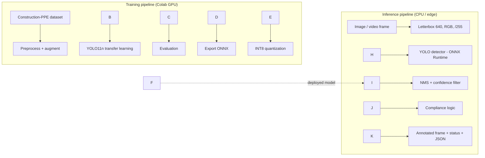

# 🦺 PPE Compliance Detection with YOLO11

A computer vision system that detects workers on construction and industrial sites and automatically flags anyone missing required personal protective equipment (PPE), such as a helmet or a high-visibility vest. It is built with a fine-tuned YOLO11 detector, optimized with ONNX export and INT8 quantization, and served through a web app.

> Final project, \*\*Computer Vision Systems Development\*\*, \[SDAIA Academy](https://github.com/SDAIAAcademy)

!\[Workflow](assets/workflow.png)

\---

## 1\. Project Overview

|||
|-|-|
|**CV task**|Object detection|
|**Model**|YOLO11n (Ultralytics), transfer learning from COCO weights|
|**Dataset**|Construction-PPE (Ultralytics), 1,416 annotated site images, 11 classes|
|**Output**|Bounding boxes + per-person compliance decision + frame status|
|**Optimization**|ONNX export + INT8 static quantization (ONNX Runtime)|
|**Application**|Gradio web app (image \& video) + CLI batch inference|

## 2\. Problem Description

Construction and industrial sites depend on manual safety inspections, which are intermittent and cannot watch every camera all the time. Missing head protection and high-visibility clothing are among the most common safety violations and contribute to serious injuries.

**Purpose:** give safety officers an automated "second pair of eyes" that checks every frame from site cameras and raises an alert when a worker is not wearing required PPE.

**Expected output:** for each input image or video frame, the system returns:

* bounding boxes for `Person`, `helmet`, `vest`, `no\_helmet` and other PPE classes
* a per-person decision (**OK** / **MISSING: helmet, vest**)
* an overall frame status: `COMPLIANT`, `VIOLATION`, or `NO PERSON`
* a JSON report for logging or integration with alerting systems

## 3\. Dataset \& Model Used

### Dataset: Construction-PPE

* Source: [Ultralytics Construction-PPE](https://docs.ultralytics.com/datasets/detect/construction-ppe/), which downloads automatically through `construction-ppe.yaml`
* Split: **1,132 train / 143 val / 141 test** images
* 11 classes: `helmet, gloves, vest, boots, goggles, none, Person, no\_helmet, no\_goggle, no\_gloves, no\_boots`
* Already annotated in YOLO format. It was chosen because it contains both "gear present" and "gear missing" classes, which a compliance system needs.
* The pipeline also works with any **Roboflow** PPE dataset exported in YOLOv8 format. Change `DATA` in the notebook to its `data.yaml`.

### Preprocessing \& augmentation

* **Preprocessing:** letterbox resize to 640×640 (aspect ratio preserved), BGR→RGB, pixel scaling to \[0, 1]
* **Augmentation:** HSV color jitter (site lighting and glare), horizontal flip, scale/translate (near and far workers), ±5° rotation, mosaic (disabled for the last 10 epochs)

### Model: YOLO11n

* One-stage real-time detector, smallest variant (\~2.6M parameters), chosen for edge and CPU deployment
* **Transfer learning:** initialized from COCO-pretrained weights (which already recognize "person") and fine-tuned on all layers for 60 epochs with early stopping

## 4\. Workflow / Architecture



**Compliance logic** (`src/ppe\_utils.py`): each detected PPE box is assigned to the person box that contains most of it (≥ 50% overlap). A person is marked non-compliant if a required item is not detected on them, or if a `no\_helmet` box is assigned to them. The required items are configurable (default: helmet + vest).

### Repository structure

```
ppe-detection/
├── notebooks/ppe\_training.ipynb   # full pipeline: data → train → eval → export → benchmark
├── src/
│   ├── ppe\_utils.py               # compliance logic, scoring, INT8 quantization
│   └── predict.py                 # CLI batch inference + JSON report
├── app/app.py                     # Gradio web app (image + video)
├── models/                        # best.pt, best.onnx, best\_int8.onnx (created by notebook)
├── assets/                        # diagram, plots, success/failure cases, results tables
├── requirements.txt
└── README.md
```

## 5\. Results \& Evaluation

All metrics are on the **held-out test split** (141 images). The notebook writes these tables to `assets/results.md`.

### Detection metrics

|Precision|Recall|mAP@50|mAP@50-95|
|-|-|-|-|
|0.703|0.529|0.550|0.265|

Per-class results are in `assets/per\_class\_metrics.csv`. For safety use, **recall on `no\_helmet`** matters most, because a missed violation costs more than a false alarm.

|Training curves|Confusion matrix|Precision-Recall|
|-|-|-|
|!\[](assets/training\_curves.png)|!\[](assets/confusion\_matrix.png)|!\[](assets/pr\_curve.png)|

### Success case

!\[Success](assets/success\_case.png)
*Short description:* \*The model correctly detected all workers and their helmets and vests, even with multiple people in the frame.\*Compliance outputFailure case

!\[Failure](assets/failure\_case.png)
*Short description:The model missed a small, distant worker and confused a cap with a helmet. More high-resolution training images would help.*output

!\[Compliance demo](assets/compliance\_demo.png)

### Optimization benchmark (CPU, batch 1)

|Model|Size (MB)|mAP@50|Latency (ms/img)|FPS|
|-|-|-|-|-|
|PyTorch FP32|5.48|0.538|161.3|6.2|
|ONNX FP32|10.61|0.532|112.3|8.9|
|ONNX INT8|4.46|0.495|124.1|8.1|

!\[Benchmark](assets/benchmark.png)

## 6\. Technologies Used

* **Python 3.10+**
* **Ultralytics YOLO11**: training, validation, export
* **PyTorch**: training backend
* **ONNX / ONNX Runtime**: portable inference and INT8 static quantization
* **OpenCV**: image and video processing
* **Gradio**: web demo
* **pandas / matplotlib**: analysis and plots
* **Google Colab (T4 GPU)**: training environment

## 7\. How to Run the Project

### Option A: Google Colab (recommended)

1. Open `notebooks/ppe\_training.ipynb` in Colab and set **Runtime → T4 GPU**.
2. Set `REPO\_URL` in the first code cell to this repository.
3. Run all cells. The notebook downloads the data, trains, evaluates, exports, quantizes, and benchmarks. Everything lands in `models/` and `assets/`.
4. The last cell launches the web app with a public link.

### Option B: Local

```bash
git clone https://github.com/<your-username>/ppe-detection.git
cd ppe-detection
pip install -r requirements.txt
jupyter notebook notebooks/ppe\_training.ipynb     # train (GPU recommended)
```

### Run the web app

```bash
python app/app.py                               # uses models/best.onnx
python app/app.py --model models/best\_int8.onnx # quantized model
```

Then open http://localhost:7860, upload a site image or video, choose the required PPE, and check compliance.

### Batch inference (CLI)

```bash
python src/predict.py --source path/to/images\_or\_video --model models/best\_int8.onnx
# → annotated outputs + outputs/compliance\_report.json
```

## 8\. Future Improvements

* **Local data:** add footage from Saudi and Gulf sites (desert light, dust, heat haze) plus night scenes, and collect hard negatives such as caps, hoods, and orange clothing.
* **Class balance:** collect more examples of rare classes or oversample them.
* **Small objects:** train at 960–1280 px or use tiled inference (SAHI) for distant workers.
* **Larger model:** YOLO11s/m for higher accuracy on a server, with n + INT8 kept for edge.
* **Temporal logic:** track workers across frames (ByteTrack) and alert only when a violation persists for several seconds, to cut false alarms.
* **Two-stage pipeline:** detect persons, then classify PPE on each person crop.
* **Integration:** push alerts to a dashboard or messaging system, and deploy on NVIDIA Jetson with TensorRT.

\---

**SDAIA Academy:** https://github.com/SDAIAAcademy

**Author:** Abdullah · [LinkedIn](https://linkedin.com/in/ibud)

*Ultralytics YOLO is licensed under AGPL-3.0. See the Ultralytics docs for dataset licensing.*

